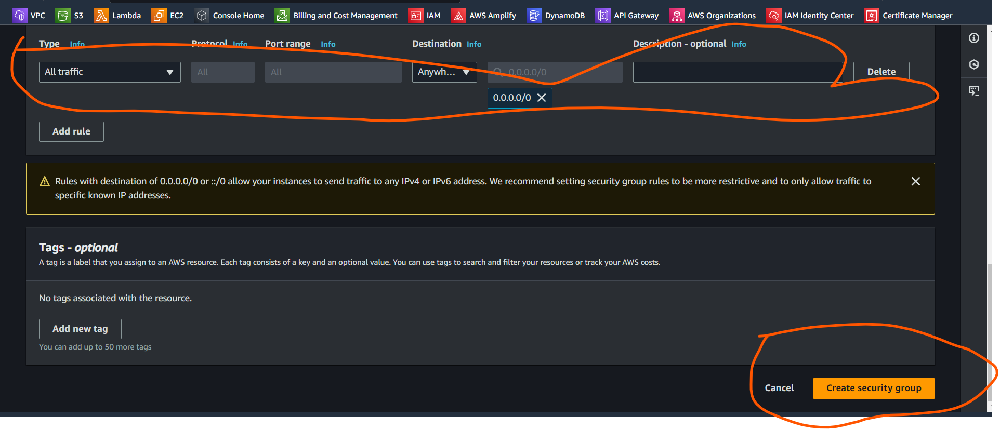
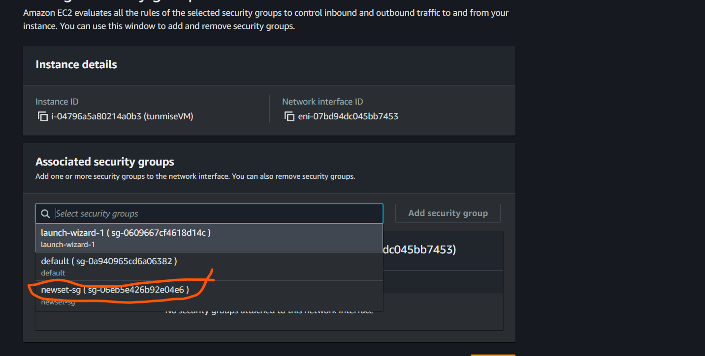
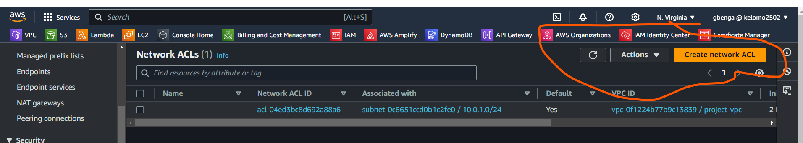
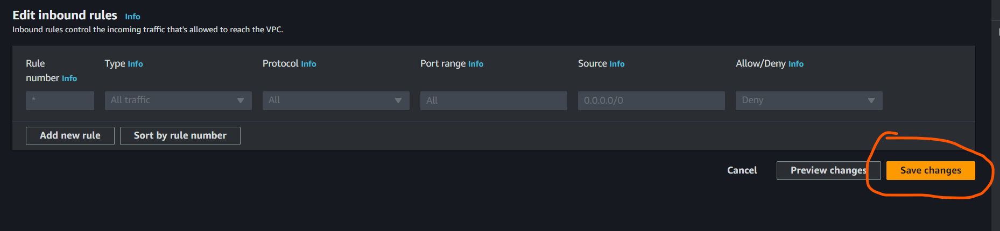

# AWS-SG-NACL

## Overview

This project hands-on project aimed at understanding the fundamental components of AWS securty groups and Network Access Contol lists. It explains how secirity group controls inbound and oubound traffic to EC2 instances and how Network Access Control Lists regulates traffic at the subnet level. Through practical demonstrations and interactive excercises, we'll navigate the AWS management console to deploy and manage this critical components effectively.

## Work through

Currently, we cannot access our previously hosted website eventhough our apache2 server appears to be serving it and this is due to the security group setting

= Creating a new security group
Locate the security group menu

- Fill all the secuirty group details
  Such as name , description, VPC

- Click on the add rule button for the inbound rule
- select HTTP under type and anywhere as source
- select All traffic under the outbound rule
- Click on the create security group

## Attaching the security group to the instance

- Click on the instance
- click on action and click security
- Click on Change security group
- Select the security group you just created
- Click add security group and save

## Changing the outbound rule and its effect

- Click on the security tab of the instance
- Click on actions and select edit outbound rules
- Click on delete and save rules
- The effect of deleting the outbound rule with the inbound still intact is that incoming traffic are still allowed
and this is so because security group are stateful

## Lets add a rule that allow HTTP on the outbound rule

- Click on the instance
- locate the security group and click on it
- Click on edit outbound rule and set it to allow HTTP from anywhere
- The effect of removing the inbound rules and allowing the outbound rule is that the ec2 instance will only allow outgoing traffic
-

## NACL

- Navigate to the VPC tab
- Click on it and find the network ACLs tab on the left hand sidebar
- Create newtowk ACL

- Provide the name of ACL
- Choose the VPC
- The click create

- if you selected the network ACL you created
- Navigate to the inbound tab and choose edit. it will be interesting to note that its denying all inbound traffic by default
- If you navigate to the outbound tab you will see its also denying all outbound traffic by default
- Back to the inbound tab and select edit inbound rules

- Click on add new rule
- Choose the number
- Specify the type
- Select the source
- And determine whether to allow or deny traffic
- The click save changes

- Our newlt created NACL is not associated with any subnet currently so lets associate it with our subnet
- Click on the NACL we just created and click on actions
- Click on edit subnet association
- Click on save changes
- Let's try an access the website again from the ec2 public address
- You notice, we cannot access the website
- Despite allowing inbound traffic , but because the outbound rule is not allow traffic(response) out
- We need to explicitly configure rule for both inbound and outbound traffic
- Now lets select the NACL again and allow all outbound traffic
- Once that has been done and save, we can now revisit the website
- Wawu! the website is visible again
