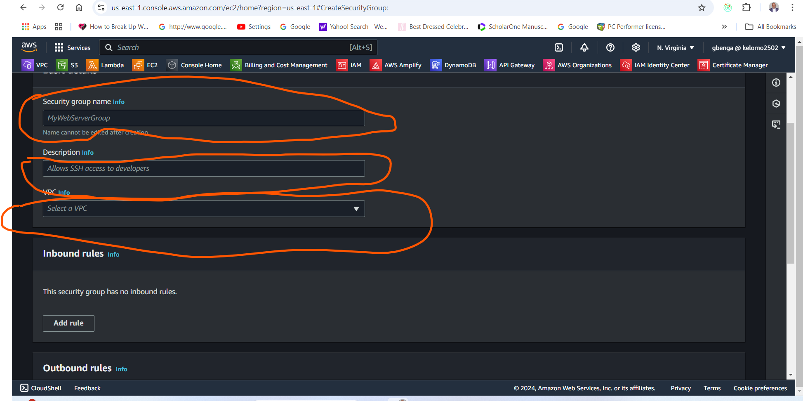

# AWS-SG-NACL

## Overview

This project hands-on project aimed at understanding the fundamental components of AWS securty groups and Network Access Contol lists. It explains how secirity group controls inbound and oubound traffic to EC2 instances and how Network Access Control Lists regulates traffic at the subnet level. Through practical demonstrations and interactive excercises, we'll navigate the AWS management console to deploy and manage this critical components effectively.

## Work through

Currently, we cannot access our previously hosted website eventhough our apache2 server appears to be serving it and this is due to the security group setting

= Creating a new security group
LOcate the security group menu

- Fill all the secuirty group details
  Such as name , description, VPC

- 
